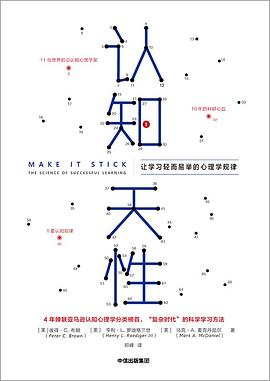

> ==学习本身是一项可以获得的技能==。最有效的策略往往不是依靠直觉。不管你想要做什么，或成为什么样的人，只有掌握了学习的能力，你才能参与竞争，才不会落伍出局。

在大部分时间里，我们都在用错误的方式学习，给后进者的建议也没有什么价值。关于如何学习，我们很多时候都自以为是，所谓的一套方法都建立在直觉与盲信之上，禁不起实证研究的考验。感觉自己知道的假象一直缠着我们，让我们在那些没用的方法上白费力气。

好消息是，现在我们知道了一些简单实用的策略，能让大家学得更好、记得更牢，而且这些策略人人可用，时时可用。这些方法包括各种形式的检索练习——例如低权重的小测验和自测、间隔练习、穿插不同但相关的科目或技能的练习，在别人教给你解决方案前先试着解决问题，从不同类型的问题中提取基本原理或规则，等等。我们会在接下来的内容中深入讨论这些策略。